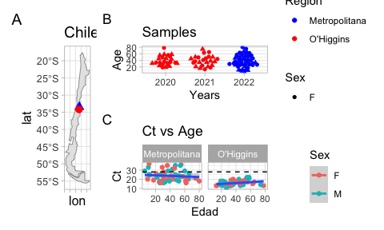

Tidyverse_COVID_Example
================
Alex Di Genova
2024-06-11

## COVID 19 data analysis

This Rmarkdown is designed to handle COVID 19 data and produce figures
as well as informative analysis.

### Demographic data of COVID19 samples

We start plotting a Chilean map

``` r
library(ggplot2)
library(rnaturalearth)

# Obtener los datos geográficos de Chile
chile_map <- ne_countries(country = "Chile", returnclass = "sf")

# Coordenadas aproximadas de Santiago y Rancagua
locations <- data.frame(
  city = c("Santiago", "Rancagua"),
  lon = c(-70.6483, -70.7398),
  lat = c(-33.4569, -34.1708)
)

# Crear el mapa utilizando ggplot2 y resaltar Santiago y Rancagua
p1=ggplot(data = chile_map) +
  geom_sf() +
  geom_point(data = locations, aes(x = lon, y = lat, color = city, shape=city), size = 3) +
  scale_color_manual(values = c("Santiago" = "blue", "Rancagua" = "red")) +
  ggtitle("Chile") +
  theme_light() +
  theme(text = element_text(size = 12), legend.position = "none",  axis.text.x=element_blank()) +
  labs(color = "Ciudad")
p1
```

<!-- --> We get demographic
data

``` r
library(tidyverse)
```

    ## ── Attaching core tidyverse packages ──────────────────────── tidyverse 2.0.0 ──
    ## ✔ dplyr     1.1.4     ✔ readr     2.1.5
    ## ✔ forcats   1.0.0     ✔ stringr   1.5.1
    ## ✔ lubridate 1.9.3     ✔ tibble    3.2.1
    ## ✔ purrr     1.0.2     ✔ tidyr     1.3.1
    ## ── Conflicts ────────────────────────────────────────── tidyverse_conflicts() ──
    ## ✖ dplyr::filter() masks stats::filter()
    ## ✖ dplyr::lag()    masks stats::lag()
    ## ℹ Use the conflicted package (<http://conflicted.r-lib.org/>) to force all conflicts to become errors

``` r
library(ggbeeswarm)
df=read.table("data/all_samples.txt", h=T)
df=df %>% separate(Date, into=c("m","d","y")) %>% mutate(Ct=as.integer(Ct))

p2=df %>% ggplot(aes(x=y,y=Age,color=Region,shape=Sex)) + geom_quasirandom() +
scale_color_manual(values = c("Metropolitana" = "blue", "O'Higgins" = "red")) + labs(x="Years",y="Age",title="Samples")+
  theme_light()
p2
```

<!-- -->

``` r
p3=df %>% ggplot(aes(x=Age,y=Ct,color=Sex,group=Region)) + 
  geom_point() +
  geom_smooth(method="lm")+
  geom_hline(yintercept = 28,linetype = 2) +
  facet_wrap(.~Region)+
  labs(title="Ct vs Age",x="Edad",y="Ct") +
  theme_light()
```

We merge plot1 and plot2

``` r
library(patchwork)
(p1|p2/p3) + plot_annotation(tag_levels = 'A')
```

    ## `geom_smooth()` using formula = 'y ~ x'

    ## Warning: The following aesthetics were dropped during statistical transformation: colour
    ## ℹ This can happen when ggplot fails to infer the correct grouping structure in
    ##   the data.
    ## ℹ Did you forget to specify a `group` aesthetic or to convert a numerical
    ##   variable into a factor?
    ## The following aesthetics were dropped during statistical transformation: colour
    ## ℹ This can happen when ggplot fails to infer the correct grouping structure in
    ##   the data.
    ## ℹ Did you forget to specify a `group` aesthetic or to convert a numerical
    ##   variable into a factor?

<!-- -->

``` r
pdf("Fig1.pdf",5,3)
(p1|p2|p3) + plot_annotation(tag_levels = 'A')
```

    ## `geom_smooth()` using formula = 'y ~ x'

    ## Warning: The following aesthetics were dropped during statistical transformation: colour
    ## ℹ This can happen when ggplot fails to infer the correct grouping structure in
    ##   the data.
    ## ℹ Did you forget to specify a `group` aesthetic or to convert a numerical
    ##   variable into a factor?
    ## The following aesthetics were dropped during statistical transformation: colour
    ## ℹ This can happen when ggplot fails to infer the correct grouping structure in
    ##   the data.
    ## ℹ Did you forget to specify a `group` aesthetic or to convert a numerical
    ##   variable into a factor?

``` r
dev.off()
```

    ## quartz_off_screen 
    ##                 2

### Intra-Host Heterogeneity

We compute the number of iSNV present in the dataset and perform several
statistical analyses

#### loading the data

``` r
csv_files <- list.files(pattern="*.variants.tsv",path = "data/SNVs/")

l_data <- list()
for (file in csv_files) {
  data <- read.table(paste0("data/SNVs/",file),h=T)
  #data <- data %>% filter(ALT_FREQ >=0.95)
  data$Filename <- file
  l_data[[file]] <- data
}
# we merge all list dataframes by row
SNV_ivar <- bind_rows(l_data)
SNV_ivar=SNV_ivar %>% separate(Filename,into=c(NA,NA,"barcode"), remove=TRUE,extra="drop") %>% mutate(barcode=as.integer(barcode))

glimpse(SNV_ivar)
```

    ## Rows: 3,428
    ## Columns: 20
    ## $ REGION      <chr> "MN908947.3", "MN908947.3", "MN908947.3", "MN908947.3", "M…
    ## $ POS         <int> 241, 2475, 3037, 10475, 11222, 14408, 22450, 23179, 23403,…
    ## $ REF         <chr> "C", "A", "C", "C", "G", "C", "C", "C", "A", "C", "T", "G"…
    ## $ ALT         <chr> "T", "G", "T", "A", "T", "T", "T", "T", "G", "T", "C", "A"…
    ## $ REF_DP      <int> 4, 5, 1685, 37, 2232, 15, 10, 72, 5, 8, 71, 608, 460, 466,…
    ## $ REF_RV      <int> 0, 0, 1681, 6, 162, 8, 0, 71, 5, 8, 0, 138, 5, 5, 384, 0, …
    ## $ REF_QUAL    <int> 35, 37, 34, 61, 36, 36, 35, 37, 36, 34, 36, 34, 34, 34, 33…
    ## $ ALT_DP      <int> 2462, 1878, 6219, 4525, 5736, 7876, 7965, 4098, 7957, 3415…
    ## $ ALT_RV      <int> 0, 34, 4499, 434, 5644, 4913, 270, 4074, 7949, 3373, 14, 3…
    ## $ ALT_QUAL    <int> 36, 36, 36, 63, 36, 35, 36, 36, 36, 34, 35, 36, 35, 35, 34…
    ## $ ALT_FREQ    <dbl> 0.998378, 0.997345, 0.786518, 0.990370, 0.718347, 0.997467…
    ## $ TOTAL_DP    <int> 2466, 1883, 7907, 4569, 7985, 7896, 7977, 4171, 7963, 3428…
    ## $ PVAL        <dbl> 0, 0, 0, 0, 0, 0, 0, 0, 0, 0, 0, 0, 0, 0, 0, 0, 0, 0, 0, 0…
    ## $ PASS        <lgl> TRUE, TRUE, TRUE, TRUE, TRUE, TRUE, TRUE, TRUE, TRUE, TRUE…
    ## $ GFF_FEATURE <chr> NA, "cds-QHD43415.1", "cds-QHD43415.1", "cds-QHD43415.1", …
    ## $ REF_CODON   <chr> NA, "AAA", "TTC", "CTT", "GTC", "CCT", "CTC", "GTC", "GAT"…
    ## $ REF_AA      <chr> NA, "K", "F", "L", "V", "P", "L", "V", "D", "T", "I", "R",…
    ## $ ALT_CODON   <chr> NA, "AGA", "TTT", "ATT", "TTC", "CTT", "CTT", "GTT", "GGT"…
    ## $ ALT_AA      <chr> NA, "R", "F", "I", "F", "L", "L", "V", "G", "I", "T", "K",…
    ## $ barcode     <int> 1, 1, 1, 1, 1, 1, 1, 1, 1, 1, 1, 1, 1, 1, 1, 2, 2, 2, 2, 2…
