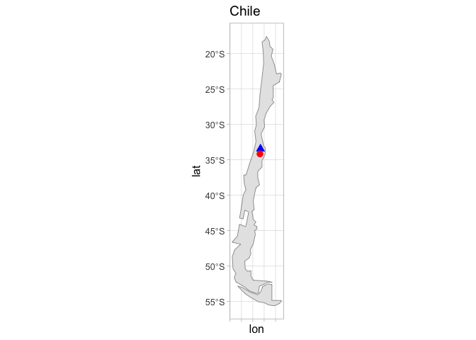
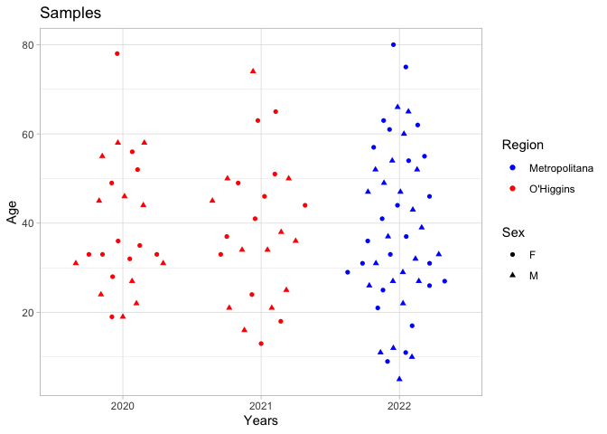

Tidyverse_COVID_Example
================
Alex Di Genova
2024-06-06

## COVID 19 data analysis

This Rmarkdown is designed to handle COVID 19 data and produce figures
as well as informative analysis.

### Demographic data of COVID19 samples

We start plotting a Chilean map

``` r
library(ggplot2)
library(rnaturalearth)

# Obtener los datos geográficos de Chile
chile_map <- ne_countries(country = "Chile", returnclass = "sf")

# Coordenadas aproximadas de Santiago y Rancagua
locations <- data.frame(
  city = c("Santiago", "Rancagua"),
  lon = c(-70.6483, -70.7398),
  lat = c(-33.4569, -34.1708)
)

# Crear el mapa utilizando ggplot2 y resaltar Santiago y Rancagua
p1=ggplot(data = chile_map) +
  geom_sf() +
  geom_point(data = locations, aes(x = lon, y = lat, color = city, shape=city), size = 3) +
  scale_color_manual(values = c("Santiago" = "blue", "Rancagua" = "red")) +
  ggtitle("Chile") +
  theme_classic() +
  theme(text = element_text(size = 12), legend.position = "none",  axis.text.x=element_blank()) +
  labs(color = "Ciudad")
p1
```

<!-- --> We get demographic
data

``` r
library(tidyverse)
```

    ## ── Attaching core tidyverse packages ──────────────────────── tidyverse 2.0.0 ──
    ## ✔ dplyr     1.1.4     ✔ readr     2.1.5
    ## ✔ forcats   1.0.0     ✔ stringr   1.5.1
    ## ✔ lubridate 1.9.3     ✔ tibble    3.2.1
    ## ✔ purrr     1.0.2     ✔ tidyr     1.3.1
    ## ── Conflicts ────────────────────────────────────────── tidyverse_conflicts() ──
    ## ✖ dplyr::filter() masks stats::filter()
    ## ✖ dplyr::lag()    masks stats::lag()
    ## ℹ Use the conflicted package (<http://conflicted.r-lib.org/>) to force all conflicts to become errors

``` r
library(ggbeeswarm)
df=read.table("data/all_samples.txt", h=T)
df=df %>% separate(Date, into=c("m","d","y")) %>% mutate(Ct=as.integer(Ct))

p2=df %>% ggplot(aes(x=y,y=Age,color=Region,shape=Sex)) + geom_quasirandom() +
scale_color_manual(values = c("Metropolitana" = "blue", "O'Higgins" = "red")) + labs(x="Years",y="Age",title="Samples")+
  theme_minimal()
p2
```

<!-- -->

We merge plot1 and plot2

``` r
library(patchwork)
(p1|p2) + plot_annotation(tag_levels = 'A')
```

<!-- -->

``` r
pdf("Fig1.pdf",5,3)
(p1|p2) + plot_annotation(tag_levels = 'A')
dev.off()
```

    ## quartz_off_screen 
    ##                 2
